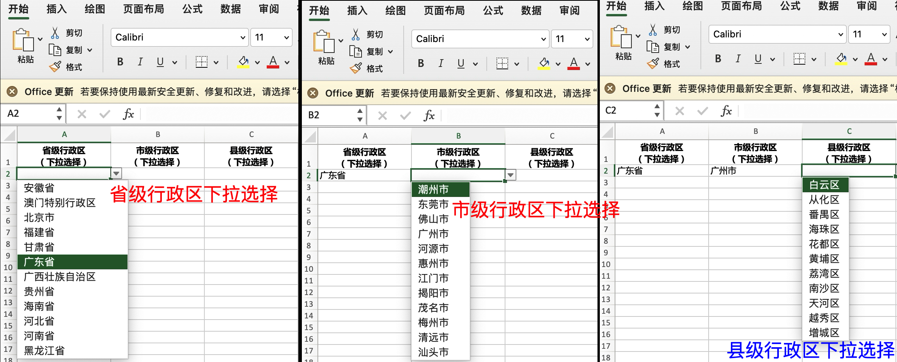

# mooon-district

一个行政区数据工具，可以用来生成 json 格式数据、SQL 插入语句、csv 格式的数据和省市县三级行政区联动的Excel下拉选择模版。

# 数据说明

* 数据来源于[民政部官网](https://www.mca.gov.cn/n156/n186/index.html)的公开数据，只支持三级行政区：省/自治区/直辖市、市/州/盟、区/县/县级市/旗，不支持到乡镇和街道这一级行政区；
* district-2022.csv 为 2023 年度更新的数据源文件，也可视为本工具的输入文件格式的样例文件，使用时可参数方式指定为其它文件。

# 安装工具

```shell
go install github.com/eyjian/mooon-district@latest
```

# 生成 json 格式数据

```shell
mooon-district -f ./district-2022.csv -with-json=true
```

# 生成 csv 格式数据：

```shell
mooon-district -f ./district-2022.csv -with-csv=true
```

# 生成 sql 插入语句：

```shell
mooon-district -f ./district-2022.csv -with-sql=true
```

# 生成 xlsx 省市县三级行政区联动模版：

```shell
mooon-district -f ./district-2022.csv -with-xlsx=true
```

使用时，可同时指定：-with-json=true、-with-csv=true、-with-sql=true 和 -with-xlsx=true：

```shell
mooon-district -f ./district-2022.csv -with-sql=true -with-csv=true -with-json=true
```

如果是新增更新，可指定参数“-with-sql-ignore”值为 true 生成“INSERT IGNORE INTO”语句。

# 特别说明

* 省直辖县/县级市/旗，没有父级行政区地级市，它的行政区代码仍然是县/县级市/旗级的，如河南省的济源市
* 省市县三级行政区联动模版，程序只完成列不含标题的前三行数据行，更多可以复制方式完成，效果请参见**效果图.jpg**
* Excel 的出生日期计算公式（限 18 位身份证，B5 为身份证所在单元格）：=IF(LEN(B5)<>18,"",DATE(MID(B5,7,4),MID(B5,11,2),MID(B5,13,2)))
* Excel 的性别计算公式（限 18 位身份证，B5 为身份证所在单元格）：=IF(LEN(B5)<>18,"",IF(MOD(MID(B5,17,1),2),"男","女"))
* Excel 的年龄计算公式（限 18 位身份证，B5 为身份证所在单元格）：=IF(LEN(B5)<>18,"",YEAR(NOW())-YEAR(MID(B5,7,4))-IF(MONTH(NOW())<MID(B5,11,2) OR (MONTH(NOW())=MID(B5,11,2) AND DAY(NOW())<MID(B5,13,2)),"",1))
* Excel 禁止第3行和第4行可修改，数据验证自定义：=AND(ROW()<3,ROW()>4)

# 省市县三级行政区联动效果图

请参见本目录下的**效果图.jpg**，example.xlsx 为生成的省市县三级行政区联动模版。

